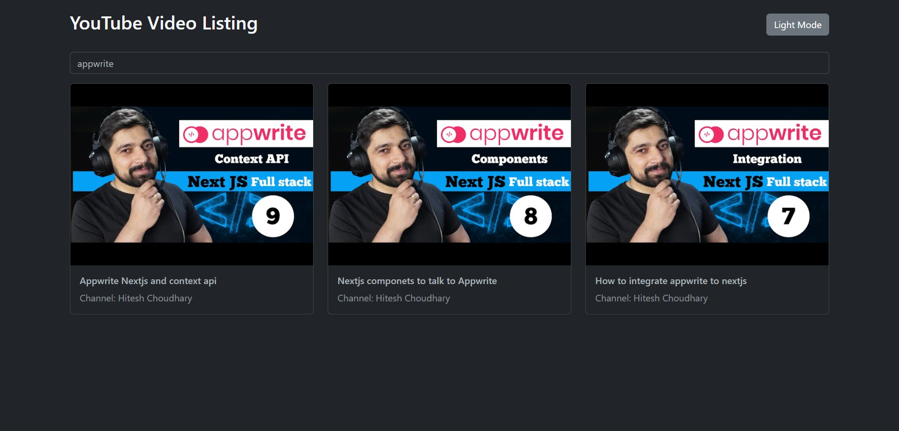

# Freetube

Freetube is a web application that allows users to browse and search for YouTube videos. It provides a clean and responsive interface with features like dark mode and search functionality.

## Features

- **YouTube Video Listing**: Displays a grid of YouTube videos fetched from an API.
- **Search Functionality**: Allows users to search for videos by title.
- **Dark/Light Mode Toggle**: Users can switch between dark and light themes.
- **Responsive Design**: Optimized for both desktop and mobile devices.

## Screenshots

### Home Page


### Dark Mode


### Search Functionality



## Deployment

- **Hosted Application**: [Freetube on Vercel](https://freetube-lilac.vercel.app/)
- **GitHub Repository**: [Freetube on GitHub](https://github.com/rejisterjack/freetube)

## Getting Started

1. Clone the repository:
   ```bash
   git clone https://github.com/rejisterjack/freetube.git
   ```
2. Navigate to the project directory:
   ```bash
   cd freetube
   ```
3. Install dependencies:
   ```bash
   npm install
   ```
4. Start the development server:
   ```bash
   npm run dev
   ```
5. Open the application in your browser at `http://localhost:5173`.

## License

This project is licensed under the MIT License.
